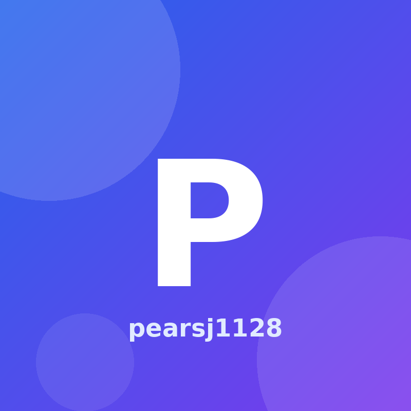

<!DOCTYPE html>
<html lang="en">
<head>
  <meta charset="UTF-8" />
  <meta name="viewport" content="width=device-width, initial-scale=1.0" />

  <title>pearsj1128 | Chemistry Portfolio</title>

  
</head>

<body>
  <a class="skip-link" href="#main">Skip to main content</a>

  <header>
    

      <a class="brand" href="#top" aria-label="Go to top of page">
        P
        pearsj1128
      </a>

      <nav aria-label="Main navigation">
        <a href="#about">About</a>
        <a href="#projects">Projects</a>
        <a href="#resume">Resume</a>
        <a href="#courses">Courses</a>
        <a href="#ai-usage">AI Usage</a>
        <a href="#contact">Contact</a>
      </nav>
    

  </header>

  <main id="main">
    <section class="hero" id="top">
      

        
 Chemistry Major Portfolio

        <h1>Hello, I’m pearsj1128.</h1>
        

          I am a <strong>Chemistry major</strong> interested in laboratory work,
          scientific data interpretation, and clear science communication.
          This website is a static personal portfolio built with HTML and CSS
          and deployed through GitHub Pages.
        

        

          <a class="button primary" href="#projects">View Projects</a>
          <a class="button" href="assets/cv.pdf">Open CV</a>
          <a class="button" href="#contact">Contact</a>
        

      

      <aside class="profile-panel" aria-label="Profile summary">
        

          
        

        <h2>pearsj1128</h2>
        
Student · Chemistry Major · Scientific Learner

        

          

            Major
            <strong>Chemistry</strong>
          

          

            Interests
            <strong>Lab work, analysis, science communication</strong>
          

          

            Website
            <strong>Hosted on GitHub Pages</strong>
          

        

      </aside>
    </section>

    <section id="about">
      

        <h2>About Me</h2>
        

          A brief introduction focused on chemistry, learning, and academic growth.
        

      

      

        I am a Chemistry major building a foundation in molecular structure,
        chemical reactions, analytical reasoning, and experimental thinking.
        I enjoy connecting classroom concepts with real observations and
        explaining scientific ideas in a clear, organized way.
      

      

        Through this GitHub Pages project, I practiced building a simple
        personal website, organizing content for an academic portfolio, and
        using AI tools responsibly to improve structure, wording, and design.
      

    </section>

    <section id="projects">
      

        <h2>Projects & Activities</h2>
        

          Academic and personal work related to chemistry, communication, and web publishing.
        

      

      

        <article class="card">
          <h3>Chemistry Learning Portfolio</h3>
          

            Organized key chemistry concepts into a readable portfolio format,
            focusing on clarity, structure, and scientific accuracy.
          

          

            Chemistry
            Study Notes
          

        </article>

        <article class="card">
          <h3>Data Interpretation Practice</h3>
          

            Practiced interpreting experimental-style results and summarizing
            observations in a concise, evidence-based way.
          

          

            Analysis
            Reasoning
          

        </article>

        <article class="card">
          <h3>GitHub Pages Website</h3>
          

            Built and deployed this static personal website using HTML, CSS,
            GitHub repository management, and GitHub Pages.
          

          

            HTML
            CSS
            GitHub Pages
          

        </article>
      

    </section>

    <section id="resume">
      

        <h2>CV / Resume</h2>
        

          A downloadable PDF resume is linked from the repository assets folder.
        

      

      

        

          <h3>Resume File</h3>
          

            The CV is available as a PDF file in the website repository.
          

          

            <a class="button primary" href="assets/cv.pdf">Download CV PDF</a>
          

        

        

          <h3>Current Focus</h3>
          <ul>
            <li>Building chemistry fundamentals</li>
            <li>Improving scientific writing and explanation</li>
            <li>Practicing data interpretation and structured reporting</li>
            <li>Learning how to present academic work online</li>
          </ul>
        

      

    </section>

    <section id="courses">
      

        <h2>Courses I Plan to Take</h2>
        

          Courses that match my Chemistry major and future academic interests.
        

      

      

        

          <strong>Organic Chemistry</strong>
          Reaction mechanisms, molecular structure, and synthesis.
        

        

          <strong>Analytical Chemistry</strong>
          Measurement, data quality, and chemical analysis methods.
        

        

          <strong>Physical Chemistry</strong>
          Thermodynamics, kinetics, and molecular-level reasoning.
        

        

          <strong>Biochemistry</strong>
          Chemical principles in biological systems.
        

      

    </section>

    <section id="ai-usage">
      

        <h2>AI Usage</h2>
        

          Transparent record of how AI assistance was used for this assignment.
        

      

      

        <h3>Tool Used</h3>
        

          I used ChatGPT as an AI assistant to plan the page structure,
          revise the content for a Chemistry major, and improve the HTML/CSS
          layout while keeping the site compatible with GitHub Pages.
        

        <h3>Example Prompts</h3>
        <ul>
          <li>
            <code>Build a static personal website for GitHub Pages using assets/profile.png and assets/cv.pdf.</code>
          </li>
          <li>
            <code>Make the portfolio fit a Chemistry major and include About, Projects, Resume, Courses, AI Usage, and Contact sections.</code>
          </li>
          <li>
            <code>Improve the design so it looks clean, responsive, and suitable for academic submission.</code>
          </li>
        </ul>

        <h3>Human Edits</h3>
        

          I checked that the major is Chemistry, reviewed the section content,
          and confirmed that the website is deployed through GitHub Pages.
        

      

    </section>

    <section id="contact">
      

        <h2>Contact</h2>
        

          Basic contact information for this personal academic portfolio.
        

      

      

        

          <h3>Email</h3>
          
pearsj1128@snu.ac.kr

          

            If this email is not correct, replace it before final submission.
          

        

        

          <h3>GitHub</h3>
          

            <a href="https://github.com/pearsj1128">github.com/pearsj1128</a>
          

          

            Website URL:
            <a href="https://pearsj1128.github.io">pearsj1128.github.io</a>
          

        

      

    </section>
  </main>

  <footer>
    
© 2026 pearsj1128. Chemistry portfolio hosted on GitHub Pages.

  </footer>
</body>
</html>
